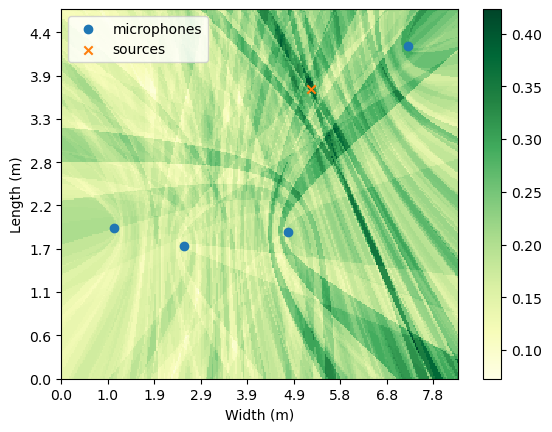

## Pysoundloc: Sound source localization methods for Python

The goal of this repository is to store classical, sound source localization methods
on Numpy/Pytorch, as well as helper functions for visualizing rooms and outputs.

The following algorithms are implemented:
- A modified implementation of the Steered Response Power (SRP) method similar to [Cobos2011]
- An implementation of the Time Difference of Arrival-based Least Squares (LS) (TDOA-LS) localization method [So2011]
- An implementation of the Energy-based LS method (Energy-LS) [Li2003]
- An implementation of the MUltiple Signal Classification (MUSIC) method [Schmidt1986]

Please see the notebooks for examples and contact me @egrinstein if you have any questions.

### References
[Cobos2011] M. Cobos, A. Marti and J. J. Lopez, "A Modified SRP-PHAT Functional for Robust Real-Time Sound Source Localization With Scalable Spatial Sampling," in IEEE Signal Processing Letters, vol. 18, no. 1, pp. 71-74, Jan. 2011, doi: 10.1109/LSP.2010.2091502.

[Li2003] Li, D., Hu, Y.H. Energy-Based Collaborative Source Localization Using Acoustic Microsensor Array. EURASIP J. Adv. Signal Process. 2003, 985029 (2003). doi: 10.1155/S1110865703212075.

[So2011] So, H.C. Source Localization: Algorithms and Analysis. Handbook of Position Location (eds S.A. Zekavat and R.M. Buehrer). 2011, doi:  10.1002/9781118104750.ch2

[Schmidt1986] R. Schmidt, "Multiple emitter location and signal parameter estimation," in IEEE Transactions on Antennas and Propagation, vol. 34, no. 3, pp. 276-280, March 1986, doi: 10.1109/TAP.1986.1143830.
